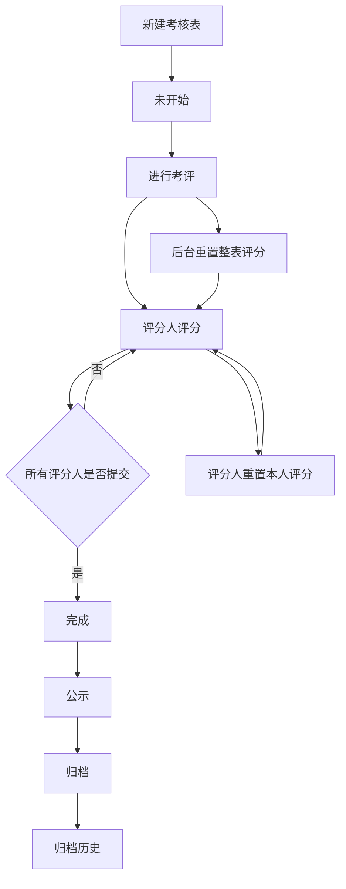

# 旧版 KPI 考核模块复刻开发说明

本文用于新独立小程序开发时复刻旧版“大仓考评”KPI 考核模块。目标是让新系统在核心业务流程、评分规则、权限、归档、查询和重置逻辑上与旧系统保持一致，同时在技术实现上避免继续依赖钉钉、企业微信或公众号入口的旧代码。

## 1. 模块定位

KPI 考核模块用于企业按月、按岗位或按部门创建考核表，由一个或多个评分人给被考核人评分，完成后可公示、归档，并支持员工或管理人员在手机端查看当前考核和历史归档记录。

旧系统中存在三类入口：

- 企业后台：管理员配置部门、人员、指标、考核表、模板、归档。
- 手机端员工页：被考核人查看自己的考核表，评分人参与评分，查看已评分和历史归档。
- 运营管理后台：平台管理员创建企业、配置客户类型和基础信息。

新小程序可重做入口和 UI，但核心业务规则应保持一致。

## 2. 用户角色

### 平台运营管理员

负责创建企业客户、设置企业类型、初始化企业管理员账号、维护企业基础信息。

### 企业超级管理员

负责企业内 KPI 模块配置和管理：

- 部门管理
- 人员管理
- 指标库管理
- 新建考核表
- 考评表管理
- 考评表模板
- 归档记录
- 管理员与查看权限设置

### 考核管理员

可按被授权范围管理考核表、指标或考核人员。旧系统中通过 `addreport`、管理范围和查看范围控制。

### 被考核人

在手机端查看自己的进行中考核表、公示结果、历史归档记录。

### 评分人

在手机端“参与评分”页面给被考核人评分。评分提交后进入“已评分”页面；如考核表未归档，可重置自己的评分后重新评分。

## 3. 企业后台功能

### 3.1 部门管理

功能：

- 查看企业部门列表。
- 支持 Excel 导入部门和人员。
- 钉钉或企业微信客户可通过平台通讯录同步生成部门和人员。

复刻建议：

- 部门应有唯一 ID、企业 ID、部门名称、上级部门。
- Excel 导入客户和平台同步客户要分清来源，避免覆盖外部平台 ID。
- 如果员工没有钉钉或企业微信 ID，应允许通过手机号密码登录手机端。

### 3.2 人员管理

功能：

- 查看人员列表。
- 按部门和姓名搜索。
- 设置人员的考核范围和归档查看权限。
- 设置人员是否进入考核组。

核心权限字段含义：

- `right = 1`：只能查看本人。
- `right = 2`：可查看本部门。
- `right = 3`：可查看全公司。
- 额外查看范围：可通过附加授权让某个人查看指定部门或人员。
- `addreport = 1`：允许作为考核管理员进入考核组。

新系统建议：

- 权限不要只写死为 1、2、3，建议拆成“本人、本部门、全公司、指定部门、指定人员”。
- 但前端展示可保持旧系统简单选项。

### 3.3 指标库管理

指标是考核表的基础项。每个指标属于企业，可关联部门。

主要字段：

- 指标名称
- 所属部门
- 指标类型
- 评分标准
- 备注

旧系统指标类型：

- 百分制
- 十分制
- 权重制
- 加减分
- 五分制

指标库功能：

- 新增、编辑、删除指标。
- Excel 导入指标。
- 从平台模板指标中导入到企业。
- 按部门、名称、类型筛选。

Excel 导入常见列：

- 部门名称
- 指标名称
- 指标类型
- 评分标准
- 权重或分值

### 3.4 新建考核表

新建考核表时需要选择：

- 考核表名称
- 被考核人
- 评分人
- 每个评分人的权重
- 考核指标
- 每个指标的分值或权重
- 是否保存为模板

旧系统会为“每个被考核人 × 每个评分人 × 每个指标”生成一行评分明细。

示例：

| 被考核人 | 评分人 | 指标 | 评分人权重 | 指标分值/权重 |
|---|---|---|---:|---:|
| 张三 | 经理 A | 工作质量 | 60 | 30 |
| 张三 | 经理 B | 工作质量 | 40 | 30 |
| 张三 | 经理 A | 工作态度 | 60 | 20 |

这类明细是后续评分、计算、归档的核心数据。

### 3.5 考评表管理

列表显示：

- 被评分人姓名
- 所属部门
- 考评表名称
- 是否完成
- 总分数
- 考评状态

操作包括：

- 查看详情
- 编辑
- 删除
- 进行考评
- 重置评分
- 公示
- 归档

批量操作包括：

- 全员考评
- 全员公示
- 全员归档

限制规则：

- 已开始考评的表不应随意编辑核心指标和评分人。
- 未归档的进行中考核表可以重置评分。
- 归档后应进入归档记录，不再出现在当前考评表管理中。

### 3.6 考评表模板

功能：

- 新建考核表时可保存为模板。
- 后续新建考核表时可选择模板快速生成。
- 模板包含指标、指标分值、评分人权重等配置。

复刻建议：

- 模板和正式考核表数据应分表存储。
- 使用模板生成考核表时，应复制一份快照，后续模板变化不影响已生成考核表。

### 3.7 归档记录

归档记录用于保存已经结束的考核表。

列表显示：

- 被评分人姓名
- 所属部门
- 考核表名称
- 总分数
- 创建时间或归档时间

操作：

- 查看详情
- 导出详情
- 删除
- 批量删除

重要规则：

- 归档时必须快照保存指标名称、指标类型、评分标准。
- 后续指标库修改或删除，不应影响历史归档记录。
- 导出文件必须包含被考核人、考核表名称、部门、指标名称、指标类型、评分人、评分时间、得分。

## 4. 手机端功能

手机端主页面分为四个页签：

- 被考核表
- 参与评分
- 已评分
- 查询历史

### 4.1 被考核表

显示当前用户作为被考核人的进行中考核表。

显示条件：

- 当前用户是被考核人。
- 考核表正在进行中。
- 考核表未归档。

点击进入详情：

- 可查看考核表名称、本人信息、指标列表。
- 未公示前原则上不显示最终分数。
- 公示后可查看分数和点评。

### 4.2 参与评分

显示当前用户需要评分但尚未提交评分的考核表。

显示条件：

- 当前用户是评分人。
- 考核表正在进行中。
- 当前评分人尚未提交该被考核人的评分。
- 考核表未归档。

提交评分后：

- 该考核表从“参与评分”移除。
- 进入“已评分”页面。

如果评分被本人重置或后台重置：

- 重新出现在“参与评分”页面。
- 不再显示在“已评分”页面。

### 4.3 评分页面

评分页面展示：

- 考核表名称
- 被考核人姓名
- 被考核人部门
- 指标列表
- 每项评分输入框
- 点评按钮
- 提交按钮

指标点击：

- 点击指标可查看评分标准。

点评：

- 每个指标可填写点评。
- 文案建议：`（可选）填评分的具体事件或和缘由`
- 点评不是强制项，除非企业另行配置。

提交规则：

- 必须对所有指标填分。
- 分数必须符合指标类型限制。
- 提交后写入评分时间。
- 只要该被考核人的所有评分人都提交完成，考核表完成状态变为“完成”。

### 4.4 已评分

显示当前用户已经提交评分的考核表。

显示条件：

- 当前用户是评分人。
- 当前评分人已提交该考核表对应被考核人的全部指标评分。
- 考核表未归档。

显示内容：

- 被考核人姓名
- 考核表名称
- 部门
- 提交日期
- 当前已提交评分计算出的总分
- `已提交分数 X 人（共 XX 人）`

总分显示规则：

- 只要已有评分人提交评分，就按所有评分人的已提交评分计算总分。
- 尚未提交的评分人暂按 0 分参与计算。
- 因此多人评分时，已评分页面显示的是当前阶段汇总分，不是最终归档分。

重置规则：

- 考核表未归档且仍在进行中时，评分人可重置自己的评分。
- 重置后只清空当前评分人的评分，不影响其他评分人。
- 重置后该表回到“参与评分”页面。

### 4.5 查询历史

用于查询已经归档的考核记录。

原有查询条件：

- 姓名
- 部门
- 开始时间
- 结束时间

查询结果：

- 按权限显示可查看的归档记录。
- 点击可查看归档详情。

近期新增建议页：

- “本月记录”：直接展示本月时间范围内已经归档、且当前用户有查询权限的考核记录。
- 默认按部门分组、部门内分数从高到低显示。
- 筛选条件只保留：
  - 多选部门
  - 分数排序规则

排序规则：

- 按部门降序，默认
- 按部门升序
- 按全部降序
- 按全部升序

“条件查询”页面保持旧逻辑不变。

## 5. 考核状态流转

### 5.1 状态字段

旧系统核心状态：

- `report.ispoint = 0`：未开始或非进行中。
- `report.ispoint = 1`：正在评分。
- `report.ispub = 0`：未公示。
- `report.ispub = 1`：已公示。
- `report_user.state = 0`：该被考核人的考核未完成。
- `report_user.state = 1`：该被考核人的考核已完成。
- `report_item.report_time = 0`：该评分人该指标未提交。
- `report_item.report_time > 0`：已提交。

### 5.2 流程



## 6. 评分算法

旧系统按指标类型分别计算。

### 6.1 百分制

适用场景：评分人给 0-100 或允许超额分。

公式：

```text
得分 = 评分人权重 × 指标分值 × 实际评分 ÷ 10000
```

例：

- 评分人权重 50
- 指标分值 30
- 实际评分 90

计算：

```text
50 × 30 × 90 ÷ 10000 = 13.5
```

### 6.2 十分制

公式：

```text
得分 = 评分人权重 × 指标分值 × 实际评分 ÷ 1000
```

### 6.3 五分制

公式：

```text
得分 = 评分人权重 × 指标分值 × 实际评分 ÷ 500
```

### 6.4 权重制

公式：

```text
得分 = 评分人权重 × 实际评分 ÷ 100
```

权重制中，指标本身的权重或满分主要用于输入限制或展示，不直接参与该公式。

### 6.5 加减分

公式：

```text
得分 = 实际填写分数
```

规则：

- 加分项只能填 0 或正数。
- 减分项只能填 0 或负数。
- 如果减分项误填正数，系统应禁止提交。
- 如果旧数据中减分项为正数，计算时应按负数处理，避免越扣越高。

### 6.6 总分

```text
总分 = 所有评分明细按类型计算后的得分之和
```

显示建议：

- 列表页可显示 1-2 位小数。
- 导出和详情页建议保留 2 位小数。

## 7. 分数输入限制

旧系统限制：

| 指标类型 | 输入限制 |
|---|---|
| 百分制 | 不能为负数，上限通常为 200 |
| 十分制 | 不能为负数，上限通常为 20 |
| 五分制 | 不能为负数，上限通常为 10 |
| 权重制 | 不能为负数，上限通常为指标值的 2 倍 |
| 加分项 | 只能填 0 或正数 |
| 减分项 | 只能填 0 或负数 |

UI 占位文案建议：

- 普通指标：显示 `满分 XX` 或 `100分制`
- 加分项：显示 `0或正分`
- 减分项：显示 `0或负分`

## 8. 公示规则

公示用于让被考核人看到评分结果。

规则：

- 必须先进行考评。
- 必须所有评分人提交完成。
- 未完成不能公示。
- 公示后被考核人可在手机端看到分数和点评。

取消或重置影响：

- 如果公示后又重置评分，应取消公示状态。
- 避免被考核人看到已经失效的旧分数。

## 9. 归档规则

归档是考核流程结束动作。

归档条件：

- 已进行考评。
- 已完成评分。
- 已公示。

归档动作：

- 将当前评分明细复制到归档表。
- 保存归档时间。
- 保存指标快照。
- 保存点评快照。
- 清理当前进行中的评分数据。
- 当前考核表从手机端“被考核表、参与评分、已评分”中移除。
- 归档记录进入“查询历史”和企业后台“归档记录”。

关键要求：

- 归档必须保存指标名称和指标类型快照。
- 否则后续导出会出现指标名称、指标类型丢失。

## 10. 重置规则

### 10.1 后台整表重置

企业管理员可对未归档、进行中的考核表执行“重置评分”。

效果：

- 清空该考核表所有评分人的评分。
- 清空当前点评。
- 清空加减分附加记录。
- 被考核人完成状态改为未完成。
- 考核表保持进行中。
- 已公示状态取消。

使用场景：

- 评分人提交后发现评分规则或评分人需要统一重新评分。
- 不需要删除考核表重新创建。

### 10.2 评分人本人重置

评分人提交后，如果考核表尚未归档，可以在“已评分”页面进入详情并重置自己的评分。

效果：

- 只清空当前评分人的评分。
- 不影响其他评分人。
- 被考核人完成状态改为未完成。
- 如已公示，则取消公示。
- 该表重新回到当前评分人的“参与评分”页面。

## 11. 权限规则

### 11.1 企业后台权限

企业后台按企业隔离数据。每个管理员只能操作自己企业的数据。

考核管理员可按授权范围管理：

- 指标
- 考核表
- 人员范围
- 归档查看范围

### 11.2 手机端历史查看权限

手机端查询历史根据权限决定能看哪些归档记录。

基础规则：

- 本人权限：只能看自己的归档记录。
- 本部门权限：可看本部门人员归档记录。
- 全公司权限：可看全公司归档记录。
- 额外授权：可看额外指定部门或人员。

新系统建议：

- 查询权限应统一封装为一个服务。
- “查询历史”和“本月记录”都调用同一套权限规则，避免一个页面能看、另一个页面不能看的问题。

## 12. 通知规则

旧系统主要通过钉钉发送通知，后续增加过企业微信分支。

通知节点：

- 进行考评后，通知评分人。
- 公示后，通知被考核人。
- 归档或其他动作可按企业配置通知。

新小程序建议：

- 通知逻辑与考核业务逻辑解耦。
- 平台入口可以是微信小程序订阅消息、企业微信、钉钉或短信，但不应影响评分、归档数据。

## 13. 数据模型建议

### 13.1 企业表

保存企业基础信息：

- 企业 ID
- 企业名称
- 企业类型
- 状态
- 人数限制
- 考核表数量限制
- 模板数量限制

### 13.2 部门表

保存企业部门：

- 部门 ID
- 企业 ID
- 部门名称
- 上级部门 ID
- 外部平台部门 ID，可为空

### 13.3 人员表

保存企业员工：

- 员工 ID
- 企业 ID
- 姓名
- 手机号
- 部门 ID
- 头像
- 外部平台用户 ID，可为空
- 是否考核管理员
- 查看权限
- 状态

### 13.4 指标表

保存指标库：

- 指标 ID
- 企业 ID
- 部门 ID
- 指标名称
- 指标类型
- 评分标准
- 备注
- 状态

### 13.5 考核表主表

保存考核表：

- 考核表 ID
- 企业 ID
- 考核表名称
- 创建时间
- 是否开始评分
- 是否公示
- 自动归档时间，可选
- 备注

### 13.6 被考核人表

保存一张考核表下的被考核人：

- ID
- 考核表 ID
- 被考核人 ID
- 完成状态

### 13.7 评分明细表

保存每个评分人对每个指标的评分：

- ID
- 考核表 ID
- 被考核人 ID
- 评分人 ID
- 指标 ID
- 评分人权重
- 指标分值或权重
- 评分
- 评分时间

### 13.8 模板表

保存考核表模板：

- 模板主表
- 模板指标明细表

模板生成正式考核表时必须复制，不要引用。

### 13.9 归档表

保存归档快照：

- 归档主记录
- 归档评分明细
- 归档指标快照
- 归档点评快照

### 13.10 点评表

保存指标点评：

- 考核表 ID
- 被考核人 ID
- 评分人 ID
- 指标 ID
- 点评内容
- 创建时间

归档时复制到归档点评表。

## 14. 新小程序接口建议

### 企业后台接口

- 部门列表、导入、编辑、删除
- 人员列表、导入、编辑、设置权限
- 指标列表、新增、编辑、导入、删除
- 考核表新建、编辑、删除
- 考核表发起评分
- 考核表整表重置
- 考核表公示
- 考核表归档
- 模板保存和读取
- 归档列表、详情、导出

### 手机端接口

- 我的被考核表列表
- 我的待评分列表
- 我的已评分列表
- 考核表评分详情
- 提交评分
- 重置本人评分
- 保存点评
- 查看点评记录
- 查询历史
- 本月记录
- 部门筛选项

## 15. 验收清单

### 创建和评分

- 能创建单人单评分人考核表。
- 能创建单人多评分人考核表。
- 能创建多人多评分人考核表。
- 评分人只看到自己需要评分的表。
- 提交后从“参与评分”移到“已评分”。
- 所有评分人提交后，后台显示完成。

### 评分算法

- 百分制、十分制、五分制、权重制、加减分分别计算正确。
- 多评分人权重计算正确。
- 未提交评分人按 0 分计算阶段总分。
- 减分项不能填正数。
- 加分项不能填负数。

### 重置

- 后台整表重置后，所有评分人都需要重新评分。
- 评分人本人重置后，只影响本人评分。
- 重置后“已评分”和“参与评分”列表状态正确。
- 已公示后重置，应取消公示。

### 公示和归档

- 未完成不能公示。
- 未公示不能归档。
- 归档后当前列表不再显示。
- 归档后历史可查询。
- 归档详情和导出中指标名称、指标类型不丢失。

### 权限

- 本人只能看本人历史。
- 部门负责人可看授权部门历史。
- 全公司管理员可看全公司历史。
- 本月记录和条件查询权限一致。

### 导入

- 第一次 Excel 导入人员成功。
- 第二次追加导入不应清空已有人员。
- 重复人员应更新或跳过，不应产生重复脏数据。
- 无外部平台 ID 的人员可用手机号密码登录。

## 16. 旧系统隐藏风险和新系统建议

### 16.1 0 分完成判断

旧代码中部分完成判断可能把 `0分` 当成未评分。新系统建议以“评分时间是否存在”判断是否提交，而不是以分数是否为 0 判断。

如果要完全复刻旧行为，需要业务确认。但从管理逻辑看，0 分是合法评分，不应被视为未提交。

### 16.2 归档快照必须完整

归档时必须保存：

- 指标名称
- 指标类型
- 指标评分标准
- 评分人
- 评分时间
- 评分结果
- 点评

不能只保存指标 ID，否则历史导出会受指标库变化影响。

### 16.3 外部平台账号不要和员工主数据混在一起

员工可能来自：

- 钉钉同步
- 企业微信同步
- Excel 导入
- 公众号手机号登录

建议新系统中员工主表独立，外部身份单独建映射表。

### 16.4 查询权限必须统一

“查询历史”“本月记录”“导出”“详情”必须走同一套权限判断，避免列表能看到但详情打不开，或详情能打开但列表不显示。

### 16.5 评分过程需要操作日志

建议记录：

- 谁创建考核表
- 谁发起考评
- 谁提交评分
- 谁重置评分
- 谁公示
- 谁归档
- 谁导出

这对企业客户处理争议很重要。

## 17. 新小程序页面建议

### 员工端

- 首页
- 被考核表
- 参与评分
- 已评分
- 本月记录
- 条件查询
- 评分详情
- 归档详情

### 管理端

- 企业概览
- 部门管理
- 人员管理
- 指标库
- 新建考核表
- 考核表管理
- 模板管理
- 归档记录
- 权限设置

## 18. 复刻优先级

第一阶段必须完成：

- 部门和人员
- 指标库
- 新建考核表
- 评分提交
- 已评分列表
- 公示
- 归档
- 历史查询
- 评分算法

第二阶段完成：

- 模板
- Excel 导入导出
- 本月记录
- 点评记录
- 本人重置
- 后台整表重置

第三阶段完善：

- 多平台通知
- 操作日志
- 自动归档
- 权限细化
- 统计报表

## 19. 开发原则

新独立小程序不要照搬旧系统的入口耦合方式。建议保留旧系统业务规则，但重新设计为：

- 统一员工主数据
- 独立外部身份映射
- 统一评分计算服务
- 统一权限服务
- 统一归档服务
- 统一通知适配器

这样可以保证业务结果和旧系统一致，同时避免以后接入钉钉、企业微信、飞书、公众号时互相影响。
