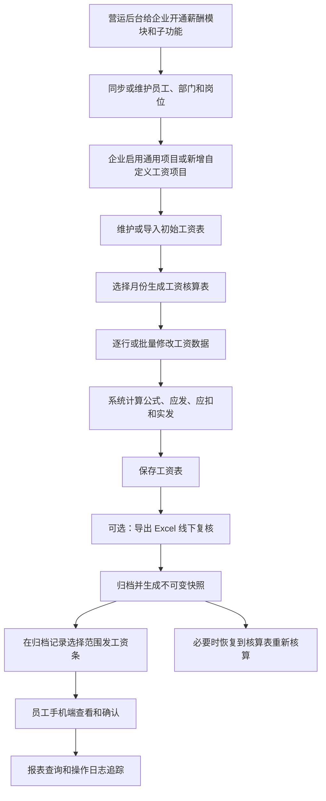

# 薪酬管理模块功能与业务流程说明

更新时间：2026-07-23  
参考代码版本：`d7a2735 Simplify payroll generation and archive flow`  
用途：供独立 HR 管理小程序设计类似薪酬模块时参考。

## 1. 模块定位

当前薪酬管理模块是在旧版多企业 SaaS 系统上增加的独立业务模块，主要服务以下两类用户：

- 企业总管理员或 HR：设置工资项目、维护初始工资、生成月工资表、核算、归档、发工资条、查询报表和管理权限。
- 企业员工或获得授权的管理者：在手机端查看本人薪酬，或者在授权范围内查看下属薪酬。

模块继续使用旧系统已有的企业、员工、部门、登录和权限体系。所有薪酬数据必须带企业标识，企业之间不得互相访问。

## 2. 角色与权限

### 2.1 SaaS 营运管理员

营运管理员负责给企业开通薪酬管理模块，并选择企业可以使用的子功能：

- 工资表核算
- 工资条发放
- 提成核算
- 绩效工资核算

工资项目设置、归档记录、报表和操作日志依附于薪酬模块及工资核算能力。

### 2.2 企业总管理员或 HR

主要权限：

- 管理工资项目和初始工资表。
- 生成、编辑、保存和归档月工资表。
- 导出工资表 Excel。
- 从归档记录发工资条。
- 设置员工的薪酬查询授权。
- 查看薪酬报表和操作日志。

### 2.3 获得薪酬查询授权的管理者

授权范围可以是：

- 指定部门。
- 指定员工。
- 是否允许导出薪酬数据。

管理者只能查看授权范围内已经发放的薪酬，不因组织上下级关系自动获得查看权。

### 2.4 普通员工

员工只能查看已经发放给本人的工资条，包括：

- 当月薪酬。
- 当年薪酬。
- 往年薪酬。
- 工资条明细。

员工查看和确认工资条都会记录时间和操作日志。

## 3. 人员与组织数据来源

薪酬模块不单独创建另一套员工档案，人员来源于企业已有的人事/员工档案。

支持的企业人员来源：

- 钉钉同步：复用旧考核系统的钉钉组织和员工同步。
- 企业微信同步：使用已经接入的企业微信通讯录同步。
- 飞书同步：当前只有平台选项和入口预留，接口尚未完成。
- 手工或 Excel：通过企业后台维护员工和部门。

部门关联必须根据员工资料的来源选择正确标识：

- 第三方平台同步员工使用对应平台部门标识。
- 手工或 Excel 员工使用系统部门表自增 ID。

工资表中的员工姓名、手机号、部门和岗位在生成时保存副本，后续人事档案变化不能修改已经归档的历史工资记录。

## 4. 工资项目设置

### 4.1 工资项目来源

工资项目分为两种来源：

- 通用项目：平台提供项目目录，每个企业自行选择启用。启用后生成该企业自己的工资项目记录，企业可以编辑；不使用时可以停用。
- 自定义项目：企业自己新增，可以编辑或删除，不提供停用操作。

历史数据中如存在“停用”的自定义项目，系统按启用处理，并纳入初始工资表和后续工资核算表。

企业修改自己的通用项目，不影响其他企业。

### 4.2 项目类别

项目类别决定项目在工资表中的业务用途：

- 应发类：计入应发总额。
- 应扣类：计入应扣总额。
- 数据类：给核算公式提供数据或保存辅助统计数据，不直接计入应发或应扣。
- 说明类：保存工资核算备注或文字说明。

应发总额、应扣总额和实发总额属于系统固定汇总列，不作为可选择的项目类别。

### 4.3 项目属性

- 数字项：手工填写、批量设置或者 Excel 导入数字。
- 文本项：填写说明文字或默认文本。
- 核算项：根据公式和其他工资项目自动计算。

数字统一保留两位小数，采用四舍五入。

### 4.4 核算公式

核算项可以引用当前企业已经启用的数字项或核算项工资项目，排除正在编辑的项目，以及系统固定的应发总额、应扣总额、实发总额。

公式支持：

- 加法 `+`
- 减法 `-`
- 乘法 `*`
- 除法 `/`
- 括号 `(`、`)`

示例：

```text
基本工资 + 岗位工资 + 绩效工资
```

被引用的数据项目建议排在核算项之前。公式结果由服务器重新计算，不能只相信前端计算结果。

### 4.5 系统固定汇总项目

每张工资表固定显示：

- 应发总额：所有应发类项目合计。
- 应扣总额：所有应扣类项目合计。
- 实发总额：应发总额减应扣总额。

三个项目由系统计算，不作为普通项目编辑或删除。

## 5. 初始工资表

初始工资表是企业生成以后每个月工资核算表的默认模板。

### 5.1 数据组成

- 当前纳入初始工资表的员工。
- 当前企业启用的工资项目。
- 每名员工每个工资项目的初始数字或文本。
- 每名员工的应发总额、应扣总额和实发总额。

### 5.2 维护方式

- 人数少的企业可以逐行编辑。
- 可以下载初始工资表模板。
- 可以通过 Excel 导入。
- 第一次导入时，如果企业没有设置工资项目，可以按 Excel 表头自动建立项目。
- 数字项目可以使用“设置金额”，范围支持全部员工、指定部门、指定岗位或指定员工。
- 可以清空当前页面数据，确认保存后才写入数据库。
- 删除员工只把员工移出初始工资表，不删除人事档案，也不影响历史工资记录。
- 被移出的员工可以恢复到初始工资表。

### 5.3 即时计算

修改员工项目数据后，页面即时重新计算：

- 核算公式项目。
- 应发总额。
- 应扣总额。
- 实发总额。

正式保存时，服务器必须再次核算，防止前端数据被篡改。

### 5.4 数据独立原则

初始工资表、月份核算表和归档工资表各自保存：

- 修改初始工资表，不影响已经生成的月工资核算表。
- 修改工资项目，不影响已经生成的月工资核算表和归档记录。
- 修改月工资核算表，不反向修改初始工资表。
- 归档记录不受人员档案、工资项目和初始工资变化影响。

## 6. 月工资表核算

### 6.1 生成工资表

操作流程：

1. HR 选择工资月份，格式为 `YYYY-MM`。
2. 点击“生成此月工资核算表”。
3. 系统读取当时的初始工资表员工、项目和数据。
4. 系统保存该月份的员工副本、工资项目快照和工资数据。
5. 系统计算每个人及整张表的应发、应扣和实发金额。

同一企业同一月份只保留一张当前核算表。该月份已经归档时，必须先从归档记录恢复，不能直接重新生成覆盖。

### 6.2 核算表编辑

核算表的表格结构和初始工资表保持一致：

- 逐行编辑和保存。
- 整张工资表保存。
- 清空当前工资数据。
- 按全部员工、部门、岗位或指定员工批量设置金额。
- 删除当前月份核算表中的员工。
- 即时重算公式项目和汇总金额。

从核算表删除员工，只影响当前月份，不影响初始工资表、人事档案或其他月份。

### 6.3 数据类项目导入

工资核算表生成后，可以下载当前月份的数据导入模板并多次导入 Excel：

- 模板带出当前工资核算表员工的手机号、姓名和数据类项目。
- 首先按手机号匹配员工；手机号重复时，再按姓名精确匹配。
- 只更新当前月份工资核算表的数据类项目。
- 同一员工同一项目重复导入时，以最后一次导入的非空值为准。
- 空白单元格不覆盖原数据，明确填写 `0` 时覆盖为 `0.00`。
- 匹配异常、无效数字和非数据类项目不写入，在当前页显示异常明细。
- 导入后重新计算核算项、应发总额、应扣总额和实发总额。
- 导入不修改初始工资表和归档记录。

### 6.4 导出复核

核算完成后可以导出 Excel，由负责人在线下检查或审核。

当前最新业务流程不再要求系统内提交审核。代码中仍保留早期审核方法和数据表，仅用于兼容历史开发，不应作为新小程序当前流程。

### 6.5 归档

归档前必须先保存所有修改。

归档时系统保存：

- 工资月份。
- 工资项目完整快照。
- 员工姓名、手机号、部门、岗位副本。
- 每名员工的项目数据。
- 每名员工应发、应扣和实发。
- 整张表汇总金额。
- 归档人和归档时间。

归档后工资表进入归档记录，不能直接修改。

## 7. 工资表归档记录

归档记录主要操作：

- 查看：按归档快照查看工资表。
- 发工资条：选择发放范围后生成或重新发放工资条。
- 恢复：把归档快照中的项目、员工和数据恢复到工资核算表继续核算。

工资表恢复规则：

- 恢复使用归档时保存的项目和员工快照，不读取最新工资项目替换旧项目。
- 原归档记录继续保留。
- 恢复后的核算表可以修改并再次归档。
- 恢复时删除该核算周期原来的工资条发布记录，避免员工继续看到已经失效的数据。

## 8. 工资条发放与企业后台查询

### 8.1 发放入口

当前流程把发工资条入口放在归档记录中。工资核算表必须先归档，HR 才能发工资条。

### 8.2 发放范围

支持：

- 全部员工。
- 指定部门。
- 指定员工。

再次发放时以选中的归档工资表数据为准。

### 8.3 工资条记录

企业后台可以查看：

- 发放月份和发放人数。
- 每名员工的发放状态。
- 员工是否查看。
- 员工是否确认。
- 查看时间和确认时间。
- 未查看、已查看未确认、已确认等筛选结果。
- 按全部、部门或指定员工导出确认结果。

## 9. 员工手机端

### 9.1 手机端入口

企业开通薪酬管理及工资条功能后，员工手机端在原考核体系中显示“薪酬”入口。

### 9.2 本人薪酬页面

- 当月薪酬：展示当前月份已经发放的工资条。
- 当年薪酬：按年份显示每月工资和年度汇总。
- 往年薪酬：显示非当前年度历史工资和汇总。
- 工资条详情：显示工资项目、应发、应扣、实发、发放时间、查看时间和确认状态。
- 工资条确认：员工确认本人已经查收工资条。

只返回当前登录员工自己的已发工资条。

### 9.3 下属薪酬页面

只有获得薪酬查询授权的员工才显示数据：

- 可按年份查看授权范围内的已发工资条。
- 可以查看被授权部门或指定员工的工资明细。
- 查看下属薪酬不替代下属本人产生“已查看”记录。
- 每次查看下属薪酬详情都记录敏感数据访问日志。

## 10. 薪酬管理授权

当前授权能力包括：

- 给指定企业用户授权可查看的部门。
- 给指定企业用户授权可查看的员工。
- 单独控制是否允许导出薪酬数据。

授权必须同时校验：

- 登录用户属于当前企业。
- 被查看员工属于当前企业。
- 查询条件落在用户授权范围内。

代码中保留了工资审核人配置，但最新工资主流程已取消系统内审核。新小程序可以暂不实现审核人功能。

## 11. 薪酬统计报表

报表支持：

- 按月份查询。
- 按部门查询。
- 按姓名或手机号查询。
- 查看员工应发、应扣和实发。
- 查看工资表来源和状态。
- 分页展示。
- 按授权范围导出。

普通被授权管理者只能查询授权部门或员工；企业总管理员可以查询本企业全部数据。

## 12. 薪酬操作日志

关键操作需要记录：

- 企业、操作人和操作时间。
- 操作代码和业务对象。
- 工资月份。
- 操作摘要。

重点日志包括：

- 工资项目新增、编辑、启用、停用和删除。
- 初始工资保存、导入、员工移出和恢复。
- 月工资表生成、保存、员工删除、导出和归档。
- 归档恢复。
- 工资条发放、查看和确认。
- 薪酬报表导出。
- 薪酬查询授权变更。
- 查看下属薪酬。

## 13. Excel 导入规则

工资表 Excel 至少包含：

- 姓名。
- 手机号。
- 一个或多个工资项目。

员工匹配规则：

1. 先按姓名匹配。
2. 企业内姓名唯一时直接匹配。
3. 存在重名时必须再按手机号匹配。
4. 手机号缺失、格式异常或无法匹配的记录进入异常列表。
5. HR 修正后重新上传。

Excel 中的金额必须能够转换为数字，所有金额保存为两位小数。

## 14. 提成核算子模块

### 14.1 提成项目设置

每个提成项目独立设置：

- 项目名称。
- 业绩口径：销售额、产品数、毛利或自定义。
- 提成方式：简单提成、阶梯提成或超额阶梯提成。
- 提成比例或固定金额。
- 阶梯规则。
- 适用范围：全公司、指定员工、指定部门或指定岗位。
- 优先级和启用状态。

### 14.2 月收入测算

以员工为测算对象：

1. 系统读取该员工命中的所有提成项目。
2. HR 为每个项目填写低位、中位和高位业绩。
3. 系统即时按规则计算三档提成。
4. 月收入等于人事档案月薪加月提成。
5. 同时显示三档年收入。
6. 测算记录可以保存、查看和删除。

测算只用于方案设计，不进入正式月提成归档。

### 14.3 月提成核算

1. 选择月份并生成提成核算表。
2. 人员来源于企业员工档案。
3. 系统按员工、部门或岗位匹配适用提成项目。
4. HR 填写或导入各项目完成量。
5. 系统计算各项目提成额和员工提成合计。
6. HR 可以修改员工适配项目，也可以从本月提成表删除员工。
7. 保存后归档。

### 14.4 提成归档

- 查看归档提成表。
- 按月份、部门和员工查询。
- 恢复到核算表重新核算。
- 删除采用软删除，开发逻辑保留 180 天后再清理。

工资归档恢复和提成归档恢复当前规则不同：

- 工资归档恢复后原工资归档记录保留。
- 提成归档恢复后当前提成归档记录删除。

### 14.5 当前未完成边界

以下提成功能尚不能视为完整交付：

- 员工端当月和历史提成查询页面。
- 提成查阅通知发布与员工查看日志完整流程。
- 提成业绩 Excel 导入。
- 提成数据并入工资项目的正式联动。

## 15. 绩效工资核算

当前只有功能入口预留，尚未形成完整业务实现。新小程序不应把该入口当成已完成模块。

后续建议的数据流：

```text
已完成绩效结果
    -> 绩效工资规则
    -> 生成绩效工资金额
    -> 写入工资核算表的绩效工资项目
```

## 16. 工资主流程



## 17. 新小程序建议复用范围

建议完全复用的业务规则：

- 工资项目类别、属性和公式规则。
- 初始工资表、月工资表和归档快照相互独立。
- 工资表由初始工资表生成。
- 归档后才能发工资条。
- 工资条按全部、部门或员工发放。
- 员工只能查看本人已发工资条。
- 下属薪酬必须显式授权。
- 所有金额由服务器复算并保留两位小数。
- 企业隔离、权限校验和敏感操作日志。

小程序页面建议简化：

- 员工端使用原生小程序页面。
- 老板或管理员常用的生成、修改、归档和发工资条可以使用原生页面。
- 工资项目公式、宽表批量编辑和 Excel 导入导出，第一阶段可使用 H5 管理页，降低开发量。

## 18. 新项目最低验收条件

- 不同企业之间无法查询、修改或导出对方薪酬数据。
- 普通员工无法通过修改请求参数查看他人工资条。
- 已归档工资表不随员工、部门或工资项目变化。
- 恢复归档后金额、项目和员工数据与归档快照一致。
- 公式、应发、应扣和实发均由服务器计算。
- 重复提交归档和发放请求不会产生错误重复数据。
- 导出接口进行权限校验并记录日志。
- 所有薪酬金额统一保留两位小数。
- 上线前使用人工测试企业走完完整工资流程。
